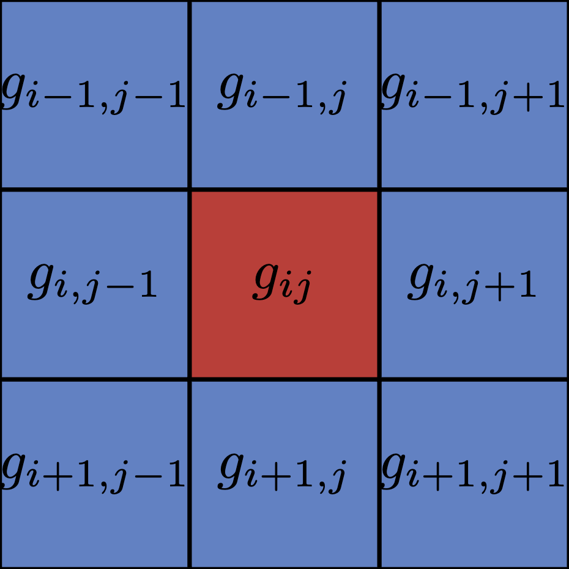

# Model
In this document you will find a detailed explanation of the simulated model inner working.

## Model Philosophy

This model is ment to showcase the balence brought by natural destruction. Therefore wildfire in this simulation can be seen as any disruptive event that affects the vegetation. We label such events as "wildfires" for simplicity, but they could represent other phenomena such as floods, pests, or human activities that lead to sudden changes in the environment. This abstraction also comes from the time scale of the simulation, that is in years. At this scale, the intricacies of wildfires are not distinguishable from other disruptive events.

The wildlife is modeled globaly because animals may move a lot in a large time scale and the detail of the animals populations repartition would not be relevent. This and the fact that seeds may be displaced over long distence by wildlife are the justification of the probabilistic nature of the vegetation growth cellular automaton (CA).

## vegetation growth CA
To simulate vegetation growth, we use a CA approach. The reason for this spacial approach is to add percolation properties to the vegetation growth, which are important for the wildfire dynamics. In this section $g_{ij}\in [0,1]$ represent the cell state at position $(j,i)$ and $G_{ij}\in [0,1]$ the updated cell state of the same cell.

   
  <small>Fig 1: Moore neighborhood of \( g_{ij} \).</small>

Similarly to the **Conway's Game of Life**, the vegetation growth CA use a the **Moore neighborhood**. Moore neighborhood englobe all adjacent cells as shown in **fig 1**. From this we define the probablity that the cell updates $\mathbb{P}(G_{ij})$ to be the average of all adjacent cells as show bellow.

Let the set $M_{ij}$ contain all the cells in the Moore neighborhood of the cell $(j,i)$, then
- $\mathbb{P}(G_{ij})=\frac{1}{8}\displaystyle\sum_{g\in M_{ij}} g$

If the cell update does not occure the vegetation change is $G_{ij}=g_{ij}$, in the other case it is defined by:   
- $G_{ij}= \max(0,\min(1,g_{ij}+p_g-\frac{x_t}{N^2}))$

where:
- $p_g\in\mathbb{R}^+$ is the **plant growth**, it is typicaly in $[0,1]$ but values bigger then 1 can be used to simulate environement with high prey population.
- $x_t\in\mathbb{R}^+$ the **prey population** before being updated.
- $N\in\mathbb{N}$ is the length of the simulation (wich is a $N\times N$ square).  

### Justification of $G_{ij}$

If the plant population encrease then $G_{ij}=g_{ij}+p_g$. To avoid making $G_{ij}$ bigger then 1 we add a min function such that $G_{ij}=\min(1,g_{ij}+p_g)$.  

Now lets add the effect of herbivors by removing the normalized population ($\frac{x_t}{N^2}$), this design choice to remove absolute population come from the fact that in this simulation model behaviour is more importent then data accuracy (as discussed in the [Model Philosophy](#model-philosophy) section). Once again we need to ensure $G_{ij}$ does not go out of bounds, this time by using a max function. then the final result is $G_{ij}= \max(0,\min(1,g_{ij}+p_g-\frac{x_t}{N^2}))$.

## lightning strikes

## Wildlife (predators & preys)
To simulate wildlife dynamics, we use numerical approximations of the **Lotka–Volterra equations** (also known as the **predator–prey model**). This model describes the coupled evolution of predator and prey populations and allows us to study how their dynamics respond both to mutual interactions and to external environmental factors such as vegetation availability.

### Numerical implementation

We start with the **lotka-volterra equations**:  
- $\frac{dx}{dt}=\alpha x-\beta xy$  
- $\;\frac{dy}{dt}=-\gamma y+\delta xy$  

where:
- $x$ is the prey population (e.g., rabbits)
- $y$ is the predator population (e.g., foxes)
- $t$ is time
- $\alpha, \beta, \gamma, \delta$ are parameters representing interaction rates.

Since the model evolves in discrete time, we approximate the time derivatives using the forward Euler method:  
- $\frac{dx}{dt}\approx \frac{\Delta x}{\Delta t}=\frac{x_{t+1}-x_t}{\Delta t}$   
- $\frac{dy}{dt}\approx \frac{\Delta y}{\Delta t}=\frac{y_{t+1}-y_t}{\Delta t}$  

This gives the following update rules:  
- $x_{t+1}=\alpha x_t \Delta t - \beta x_ty_t\Delta t+x_t$  
- $y_{t+1}=-\gamma y_t\Delta t +\delta x_ty_t\Delta t+y_t$  

In the simulation, we absorb the time step $\Delta t$ into the parameters $\alpha$, $\beta$, $\gamma$ and $\delta$ for improved code readability, leading to:  
- $x_{t+1}=\alpha x_t - \beta x_ty_t+x_t$  
- $y_{t+1}=-\gamma y_t +\delta x_ty_t+y_t$  

> [!CAUTION]  
> In my code, the constants and $\Delta t$ are defined separately. Such that `alpha = alpha * delta_t` and so on.

To account for vegetation availability, the prey growth rate is coupled to the vegetal biomass and prey population, leading to competition for resources. In order to model this, we modify the prey growth rate $\alpha$ as follows:
- $\alpha=\alpha_{max}\frac{B_v-\epsilon x_t}{N^2}$
   
 where:
- $\alpha_{max}$ is the maximal prey population growth
- $B_v$ is the vegetal biomass
- $N$ is the size of the simulation(a $N\times N$ square). 
- $\epsilon$ is a competition coefficient representing the impact of prey population on vegetation availability.

The final update equations are therefore:   
- $\boxed{x_{t+1}=\alpha_{max}\frac{B_v-\epsilon x_t}{N^2}x_t - \beta x_ty_t+x_t}$  
- $\boxed{y_{t+1}=-\gamma y_t +\delta x_ty_t+y_t}$

## Sources
